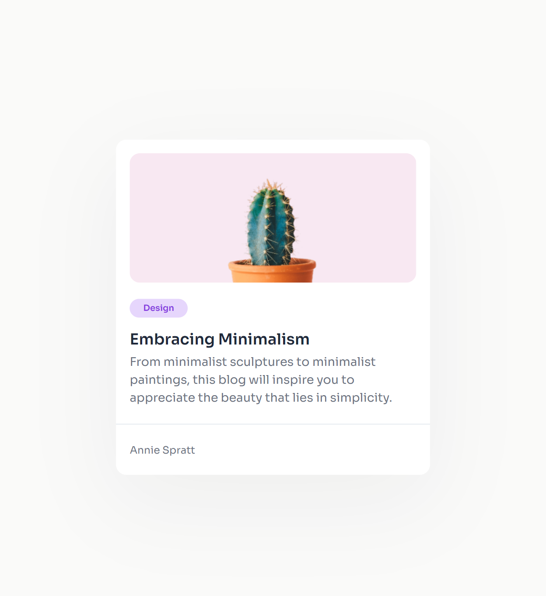

<!-- Please update value in the {}  -->

<h1 align="center">Minimal Blog Card</h1>

<div align="center">
   Solution for a challenge from  <a href="http://devchallenges.io" target="_blank">Devchallenges.io</a>.
</div>

<div align="center">
  <h3>
    <a href="https://h-yoshikawa44.github.io/ch-minimal-blog-card/">
      Demo
    </a>
    <span> | </span>
    <a href="https://devchallenges.io/solution/4229">
      Solution
    </a>
    <span> | </span>
    <a href="https://devchallenges.io/challenge/minimal-blog-card">
      Challenge
    </a>
  </h3>
</div>

<!-- TABLE OF CONTENTS -->

## Table of Contents

- [Table of Contents](#table-of-contents)
- [Overview](#overview)
  - [Desktop](#desktop)
  - [Mobile](#mobile)
  - [Built With](#built-with)
- [Features](#features)
- [How To Use](#how-to-use)
- [learned/improved](#learnedimproved)
- [Acknowledgements](#acknowledgements)
- [Contact](#contact)

<!-- OVERVIEW -->

## Overview

### Desktop


### Mobile



### Built With

<!-- This section should list any major frameworks that you built your project using. Here are a few examples.-->

Base

- [HTML](https://developer.mozilla.org/ja/docs/Web/HTML)
- [CSS](https://developer.mozilla.org/ja/docs/Web/CSS)
- [Node.js](https://nodejs.org/)：20.9.0
- [Vite](https://ja.vitejs.dev/)：5.0.7

Other major libraries

- [Lightning CSS](https://lightningcss.dev/)

## Features

<!-- List the features of your application or follow the template. Don't share the figma file here :) -->

This application/site was created as a submission to a [DevChallenges](https://devchallenges.io/challenges) challenge. The [challenge](https://devchallenges.io/challenge/minimal-blog-card) was to build an application to complete the given user stories.

- [x] Create a card component that matches the given design.
- [x] Use HTML to create the basic structure.
- [x] Use CSS to style the card.

## How To Use

<!-- Example: -->

To clone and run this application, you'll need [Git](https://git-scm.com) and [Node.js](https://nodejs.org/en/download/) (which comes with [npm](https://www.npmjs.com/)) installed on your computer. From your command line:

```bash
# Clone this repository
git clone https://github.com/h-yoshikawa44/ch-minimal-blog-card.git
# or
git clone git@github.com:h-yoshikawa44/ch-minimal-blog-card.git

# Install dependencies
npm install

# Run the Vite
npm run dev
```

## learned/improved

- I now understand the flow of the new devchallenges.
- Although it was a simple assignment, it also provided an opportunity to test the introduction of new technologies, such as
  - MarkupLint
  - Lightning CSS
  - nano-staged

## Acknowledgements

<!-- This section should list any articles or add-ons/plugins that helps you to complete the project. This is optional but it will help you in the future. For exmpale -->

- [MarkupLint](https://markuplint.dev/ja/)
- [Lightning CSS](https://lightningcss.dev/)

## Contact

- Website：[h-yoshikawa44.com](https://h-yoshikawa44.com)
- GitHub：[@h-yoshikawa44](https://github.com/h-yoshikawa44)
- Twitter：[@yoshi44_lion](https://twitter.com/yoshi44_lion)
